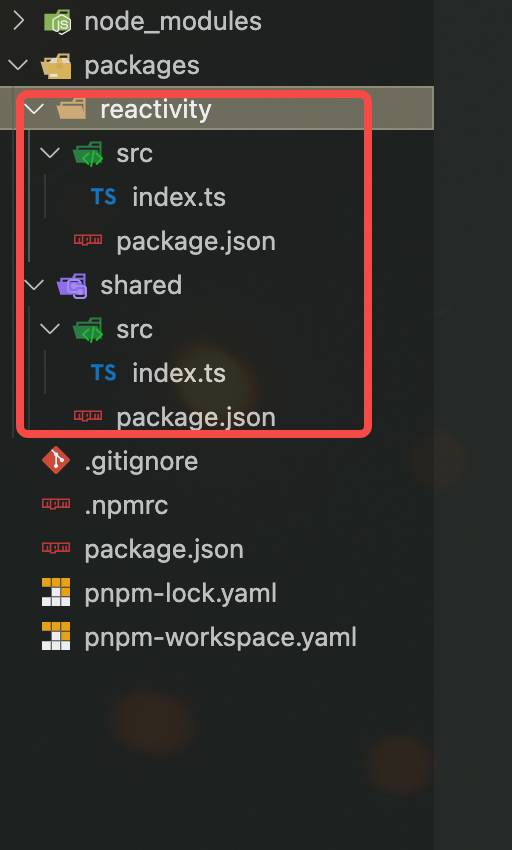
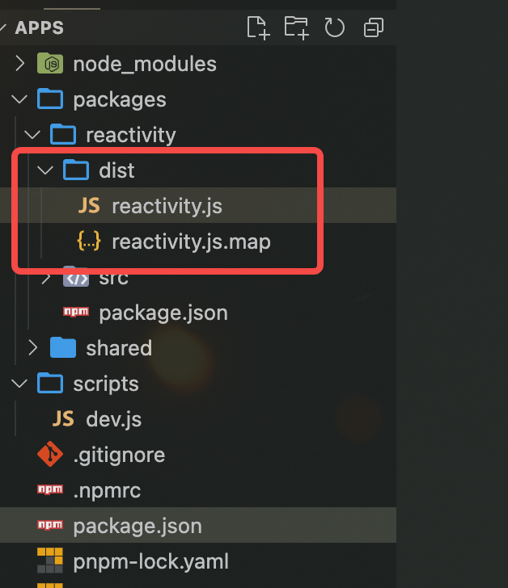

# 搭建 vue3 开发环境

## 创建 monorepo 环境

```sh
mkdir vue3.4
cd vue3.4
pnpm init
touch .npmrc
touch .pnpm-workspace.yaml
mkdir packages
mkdir packages/reactivity
mkdir packages/shared
mkdir scripts
mkdit script/dev.js
pnpm install typescript minimist esbuild -D -w
pnpm tsc --init
```

#### 编写 .npmrc

```sh
shamefully-hoist = true # 将node_modules的提升到
```

#### 编写 .pnpm-workspace.yaml

```json
packages:
  - 'packages/*'
```

#### 编写 json 的文件



./packages/reactivity/package.json reactivity 是存放响应式相关代码的包

```json
{
  "name": "@vue/reactivity",
  "version": "1.0.0",
  "module": "dist/reactivity.esm-bundler.js", // 打包后的文件
  "unpkg": "dist/reactivity.global.js", // 打包后的文件
  "buildOptions": {
    "name": "VueReactivity", // 包名
    "formats": ["esm-bundler", "esm-browser", "cjs", "global"] // 打包格式
  },
  "dependencies": {
    "@vue/shared": "workspace:*" // 依赖包
  }
}
```

./packages/shared/package.json shared 包 是 reactivity 和 runtime-core 共享的包

```json
{
  "name": "@vue/shared",
  "version": "1.0.0",
  "module": "dist/shared.esm-bundler.js",
  "buildOptions": {
    "formats": ["esm-bundler", "cjs"]
  }
}
```

**buildOptions** 是 esbuild 的配置，用于指定打包的格式,用于构建包的时候使用

**"esm-bundler", "esm-browser", "cjs", "global"** 是 esbuild 的打包格式

- esm-bundler: 浏览器打包 esm 格式 最推荐的
- esm-browser: 构建工具的时候需要用到
- cjs: node 中使用
- global: 浏览器打包 暴露全局对象

**workspace:\*** 表示当前包依赖于其他包 不需要指定版本号，会自动获取

#### 编写 tsconfig.json

```json
{
  "compilerOptions": {
    "outDir": "dist", // 输出的目录
    "sourceMap": true, // 采用sourcemap
    "target": "es2016", // 目标语法
    "module": "esnext", // 模块格式
    "moduleResolution": "node", // 模块解析方式
    "strict": false, // 严格模式
    "resolveJsonModule": true, // 解析json模块
    "esModuleInterop": true, // 允许通过es6语法引入commonjs模块
    "jsx": "preserve", // jsx 不转义
    "lib": ["esnext", "dom"] // 支持的类库 esnext及dom
  }
}
```

#### 修改根目录的 package.json

```json
{
  //....
  "scripts": {
    "dev": "node scripts/dev.js reactivity -f esm" // 打包reactivity 为esm模块
  }
  //...
}
```

### 编写 scripts/dev.js

```js
import esbuild from 'esbuild'; // 打包工具
import minimist from 'minimist'; // 命令行参数解析
import { resolve, dirname } from 'path';
import { fileURLToPath } from 'url';
import { createRequire } from 'module';
const require = createRequire(import.meta.url); // 可以在es6中使用require语法
const args = minimist(process.argv.slice(2)); // 解析打包格式和打包模块
const format = args.f || 'iife';
const target = args._[0] || 'reactivity';

// __dirname在es6模块中不存在需要自行解析
const __dirname = dirname(fileURLToPath(import.meta.url));

const pkg = require(`../packages/${target}/package.json`);

esbuild
  .context({
    entryPoints: [resolve(__dirname, `../packages/${target}/src/index.ts`)],
    outfile: resolve(
      // 输出的文件
      __dirname,
      `../packages/${target}/dist/${target}.js`
    ),
    bundle: true, // 全部打包
    sourcemap: true, // sourcemap源码映射
    format, // 打包格式 esm , cjs, iife
    globalName: pkg.buildOptions?.name, // 全局名配置
    platform: 'browser', // 平台
  })
  .then((ctx) => {
    console.log('watching~~~');
    return ctx.watch(); // 监控文件变化
  });
```

### 启动命令

```sh
pnpm dev
```


